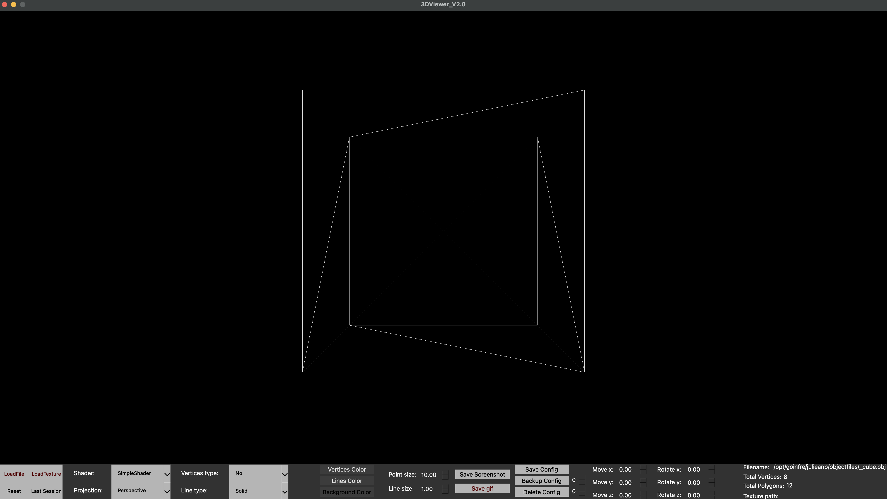
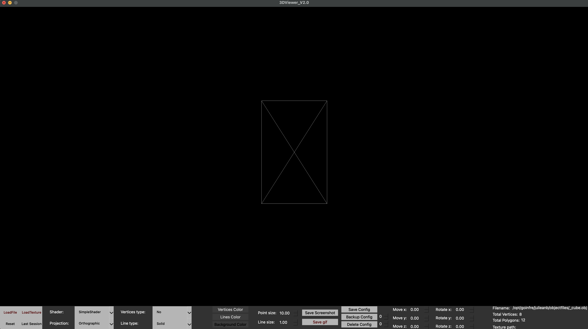
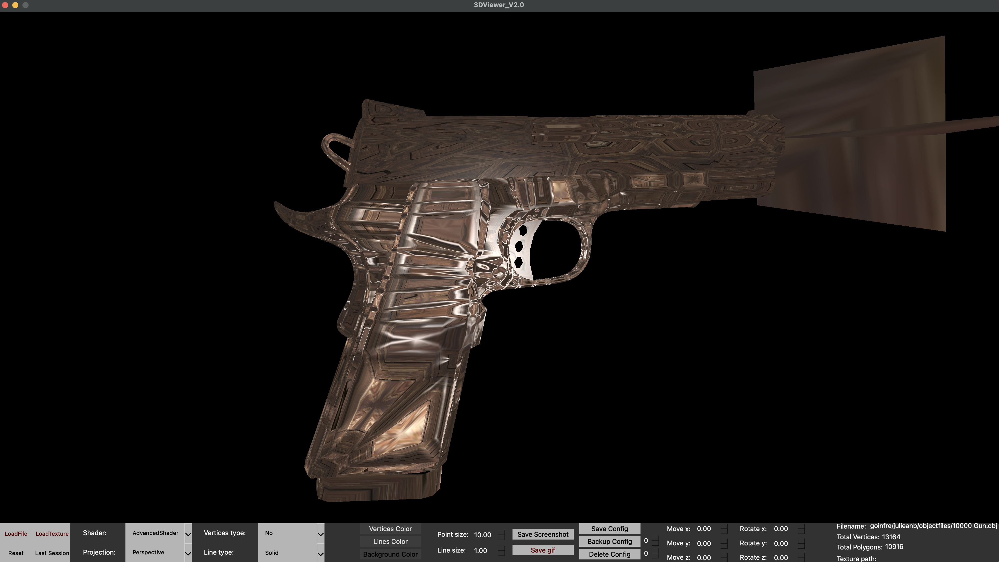
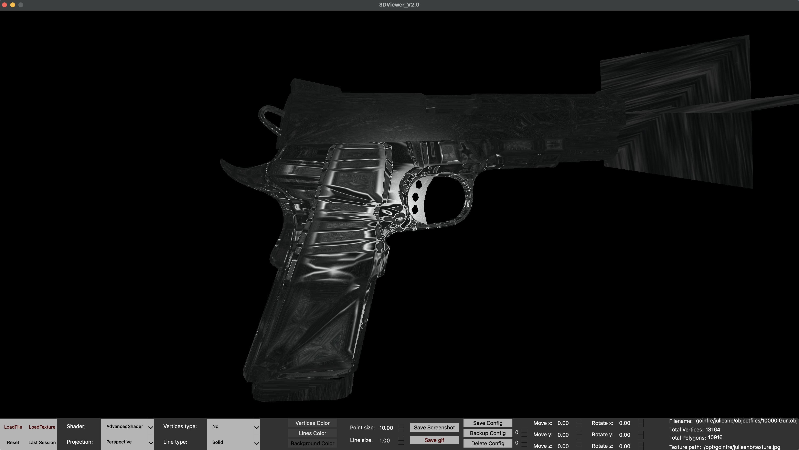
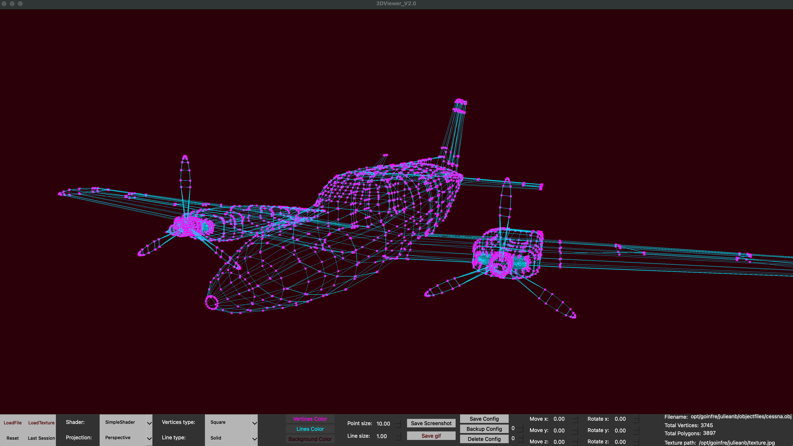
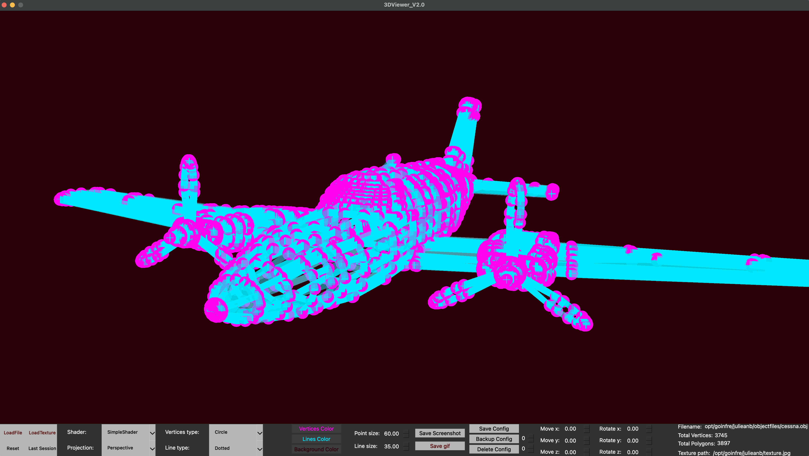
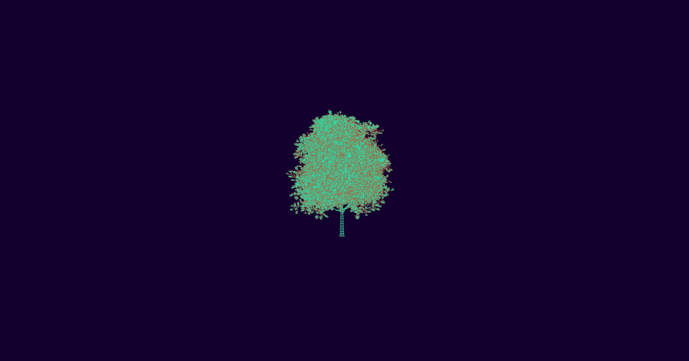
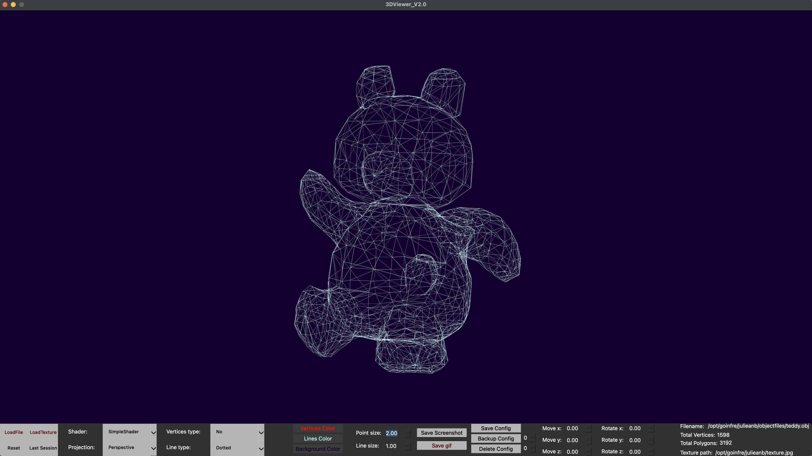
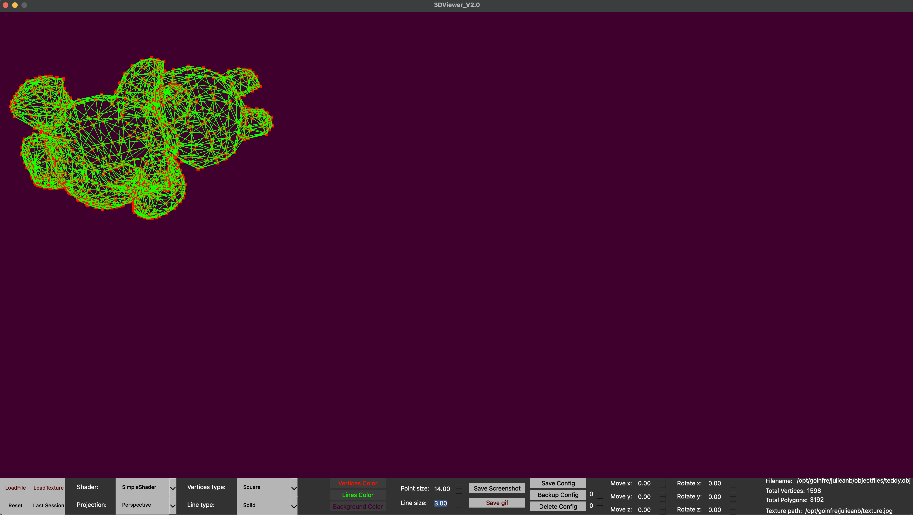
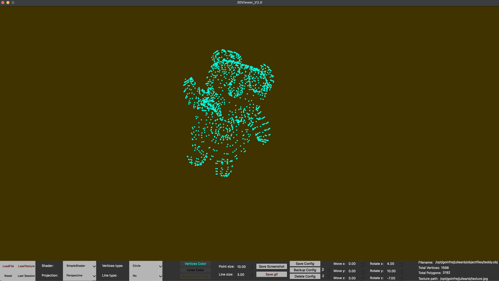

## 3DViewer_V2.0
### Made by Julieanb

- This is the second version of the educational project "3DViewer". Written in C++ using MVC in QT.

- The program is capable of displaying .obj format files.

- The program uses shaders. There are two shader options: with one you can display only the frame of the model, 
with the other you can also apply a texture and work with light.

- You can edit the appearance of lines and vertices in the case of a wireframe shader.

- It is possible to save screenshots or gif files.

- You can rotate (LMB), move (RMB) and scale (Wheel) the model both using the mouse and using user interface elements. 
Transformations received from the mouse and the interface are separated from each other.

## Makefile targets

- all: Collects model tests and checks coverage.

- test: Gathers only model tests using gtest.

- gcov_report: Collects model coverage tests. You need gcov/lcov to work.

- install: Installs the application and generates an executable file in the build folder.

- dvi: Generates project technical documentation using doxygen. 
The documentation is initially in the repository, 
you can view it by opening src/documentation/html/index.html.

- dist: Executes the Makefile install target, then archives the executable.

- clean: Removes files generated after the test and gcov_report targets.

## Examples
- Some screenshots may not display correctly on mobile devices.
### --I--

The program allows you to display an object in both perspective and orthographic projection.

### --II--

The program implements two sets of shaders. One of them allows you to view the model in wireframe form, 
the other allows you to apply a texture and add light to the scene.

### --III--

Using the interface, you can specify the type of vertices, type of lines, size of vertices, size of lines, colors of lines, vertices, background.

### --IV--

By clicking on the corresponding buttons, you can save the screenshot in jpeg or bmp format, or a gif file of workspace.

### --V--

A system for saving configurations has been implemented. When you click Save Config, 
you save the current matrix transformations, line, point and background colors. 
Then, in the backup and delete section, you can select the configuration of the index you need. 
The index starts at 1.

